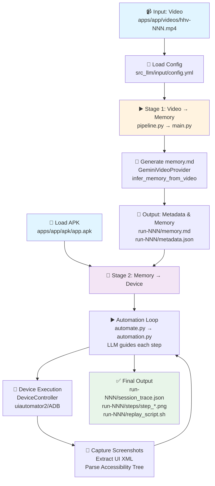
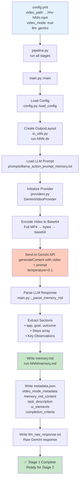
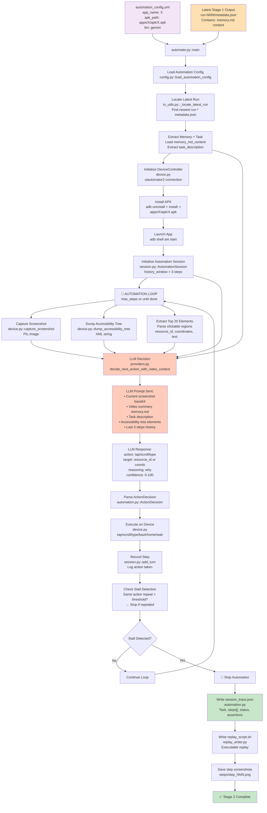
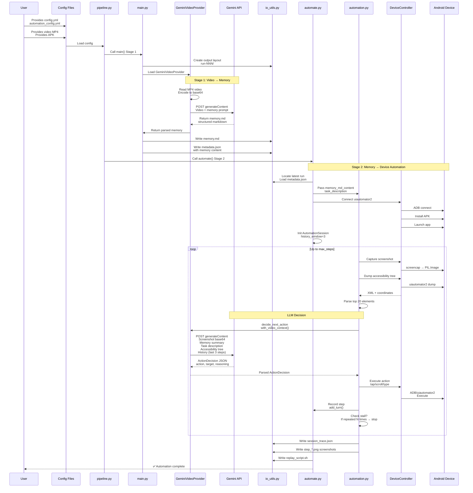

# src_llm Video Mode: End-to-End Architecture & Data Flow

Complete visual guide to the `src_llm` two-stage pipeline: **Stage 1** converts a video recording to structured memory, then **Stage 2** uses that memory to automate the same task on a live Android device.

---

## System Overview: Single Video Run

High-level flow from start to finish.



---

## Stage 1: Video → Memory (Structured Extraction)

Converts full video recording to structured markdown memory document using vision LLM.



### Stage 1 Key Artifacts

| File | Creator | Content |
|---|---|---|
| `memory.md` | `main.py` | Structured markdown memory trace: app, goal, steps, observations |
| `metadata.json` | `io_utils.py::write_run_metadata()` | Run metadata + `video_mode_metadata` (memory content, task desc, UI elements) |
| `llm_raw_response.txt` | `main.py` | Raw API response from Gemini |
| `logs/run-NNN__*.log` | `logging_utils.py` | Execution log |

---

## Stage 2: Memory → Device (Live Automation)

Uses extracted memory to guide automated execution of the same task on live Android device.



### Stage 2 Key Artifacts

| File | Creator | Content |
|---|---|---|
| `session_trace.json` | `automation.py` | Full automation trace: task, steps array, status, field assertions |
| `steps/step_NNN.png` | `automation.py` | Screenshots captured per automation step |
| `video_summary.txt` | `automate.py` | Copy of memory.md content used as context |
| `replay_script.sh` | `replay_writer.py` | Executable bash script to replay automation |
| `automate.log` | `logging_utils.py` | Per-run automation log |

---

## Complete Data Flow: Sequence Diagram

Shows all components and data movement over time.



---

## LLM Calls Detail

### Stage 1: `GeminiVideoProvider.infer_memory_from_video()`

**When:** Called once per video in Stage 1.

**Input:**
- Full video file encoded as base64
- System/user prompt from `prompts/llama_action_prompt_memory.txt`
- Model: `gemini-2.0-flash-exp` (or configured model)
- Temperature: 0.1
- API: Google Vertex AI `generateContent`

**Processing:**
Video is streamed as inline base64. Gemini processes the entire video sequence and extracts structured actions.

**Output:**
Structured markdown string with:
```
---
app: AppName
goal: What the user is trying to do
outcome: Final result
---

## Session Summary
...

## Steps
### Step 1
- Screen: Description of what's visible
- Action: What was done (tap, swipe, type, etc.)
- Details: Coordinates or element details
- Result: Outcome of the action
- Confidence: 0.0-1.0

...

## Key Observations
- Notable patterns or issues
```

**Parsed by:** `main.py::_parse_memory_md()` → extract `task_description`, `ui_elements` dict, `completion_criteria` list.

**Stored in:**
- `memory.md` (raw)
- `metadata.json["video_mode_metadata"]["memory_md_content"]` (for Stage 2)

---

### Stage 2: `GeminiProvider.decide_next_action_with_video_context()`

**When:** Called once per automation step (up to `max_steps` times).

**Input:**
```
{
  screenshot: base64-encoded PNG (current device screen),
  accessibility_tree: XML string (top 20 clickable elements),
  task_description: str (from Stage 1 memory),
  video_summary: str (full memory.md content from Stage 1),
  history: List[ConversationTurn] (last N steps taken, default N=3),
  max_steps_remaining: int
}
```

**Processing:**
- Screenshot + video summary + task context sent to Gemini
- LLM decides next action to progress toward task goal
- Considers stall detection: if same action repeated, suggest alternative

**Output:**
```json
{
  "continue": true/false,
  "action": {
    "type": "tap|scroll|type|back|home|wait",
    "resource_id": "android.widget.Button:id/submit",
    "coordinates": [100, 200],
    "text": "text to type",
    "direction": "up|down|left|right",
    "target_description": "what we're interacting with"
  },
  "reasoning": "why this action moves us toward the goal",
  "confidence": 0.85
}
```

**Parsed by:** `automation.py::ActionDecision` → `ExecutableAction` → `device.execute_action()`.

**Loop Control:**
- If `continue=false` → break loop, task complete
- If action repeated N times (stall) → break loop, task failed

---

## Input & Output: Single Video Run

### Inputs Required

| Input | Path | Format | Used By |
|---|---|---|---|
| **Stage 1 Config** | `src_llm/input/config.yml` | YAML | `main.py`, `pipeline.py` |
| **Stage 2 Config** | `src_llm/input/automation_config.yml` | YAML | `automate.py`, `pipeline.py` |
| **Video** | `apps/<app>/videos/hhv-NNN.mp4` | MP4 (h264/h265) | Stage 1 (GeminiVideoProvider) |
| **APK** | `apps/<app>/apk/<app>.apk` | Android APK | Stage 2 (DeviceController::install_apk) |
| **Memory Prompt** | `src_llm/input/prompts/llama_action_prompt_memory.txt` | Plain text | GeminiVideoProvider (prepended to request) |
| **Credentials** | `.env.local` | .env format | Both (provider auth) |

### Outputs Generated

```
apps/<app>/llm/<model>-vm/run-NNN/
├── memory.md                    # Stage 1: structured memory trace
├── metadata.json                # Stage 1: run metadata + memory_md_content
├── llm_raw_response.txt         # Stage 1: raw Gemini response
├── logs/
│   └── <timestamp>__run-NNN__pipeline__<status>.log
├── steps/
│   ├── step_001.png             # Stage 2: screenshots per step
│   ├── step_002.png
│   └── ...
├── session_trace.json           # Stage 2: full automation trace
├── video_summary.txt            # Stage 2: copy of memory.md used as context
├── replay_script.sh             # Stage 2: executable replay script
└── automate.log                 # Stage 2: automation execution log
```

---

## Module Responsibility Matrix

| Module | File | Responsibility |
|---|---|---|
| **Pipeline Orchestrator** | `pipeline.py` | Decide stage order, invoke main.py then automate.py |
| **Stage 1 Runner** | `main.py` | Load config, coordinate Stage 1 flow, write outputs |
| **LLM Provider** | `providers.py` | Encode/send API requests (Gemini, Llama, etc.) |
| **Config Parser** | `config.py` | Parse YAML config files → dataclasses |
| **Output Layout** | `io_utils.py` | Create run dirs, resolve paths, write metadata |
| **Stage 2 Runner** | `automate.py` | Load Stage 1 results, invoke automation loop |
| **Automation Loop** | `automation.py` | Per-step: screenshot → LLM → execute → stall check |
| **Device Control** | `device.py` | ADB/uiautomator2 wrapper (install, launch, tap, scroll, etc.) |
| **Session Memory** | `session.py` | Ring buffer of last N conversation turns |
| **APK Utils** | `apk_utils.py` | Extract package name & main activity from APK |
| **Replay Writer** | `replay_writer.py` | Generate bash script from session trace |
| **Logging** | `logging_utils.py` | Setup logger, rename log with status at end |
| **Env Loader** | `env_loader.py` | Load & validate `.env.local` per provider |

---

## Config Examples

### Stage 1: config.yml (Video Mode)

```yaml
llm: gemini
llm_model: gemini-2.0-flash-exp
video_mode: true
frame_sampling: 10
keyframe_selection:
  strategy: adaptive
  max_frames: 50

runs:
  - app_name: myapp
    video_path: apps/myapp/videos/hhv-001.mp4
    
output:
  overwrite: true

logging:
  level: INFO
```

### Stage 2: automation_config.yml

```yaml
llm: gemini
llm_model: gemini-2.0-flash-exp

automation:
  app_name: myapp
  apk_path: apps/myapp/apk/myapp.apk
  max_steps: 50
  history_window: 3
  stall_repeat_threshold: 3

logging:
  level: INFO
```

---

## Verification Checklist

- [ ] `src_llm/input/config.yml` and `automation_config.yml` exist with required fields
- [ ] `apps/<app>/videos/*.mp4` and `apps/<app>/apk/*.apk` available
- [ ] `.env.local` contains LLM credentials (GOOGLE_API_KEY or Vertex auth)
- [ ] `src_llm/input/prompts/llama_action_prompt_memory.txt` exists
- [ ] Run `python -m src_llm.pipeline --config src_llm/input/config.yml` (full 2-stage)
- [ ] Or run `python -m src_llm.main --config src_llm/input/config.yml` (Stage 1 only)
- [ ] Or run `python -m src_llm.automate --config src_llm/input/automation_config.yml` (Stage 2 only with prior Stage 1 metadata)
- [ ] Verify output in `apps/<app>/llm/<model>-vm/run-NNN/`
- [ ] Check `memory.md` for structured content, `session_trace.json` for automation log

---

## Key Distinctions from src_ViBR

| Aspect | src_llm | src_ViBR |
|---|---|---|
| **Stage 1** | Gemini video LLM → structured memory.md | Frame-by-frame CLIP/SSIM segmentation + GPT-4o inference per segment |
| **Output format** | Markdown memory + JSON metadata | Markdown memory.md only |
| **Speed** | Fast (one LLM call for whole video) | Slower (multiple segment-level calls) |
| **Accuracy** | Vision LLM on full video context | Ground truth device matching per segment |
| **Use case** | Mass-running, prioritize throughput | Validation, prioritize correctness |
| **Memory passing** | Entire memory.md → Stage 2 | Entire memory.md → Stage 2 |